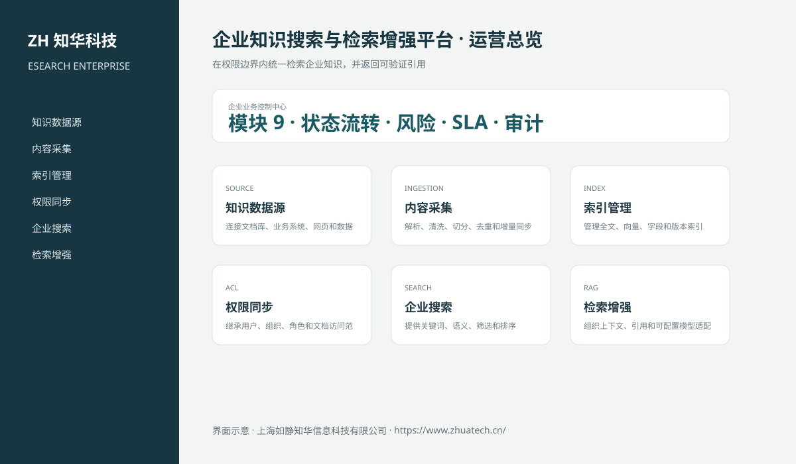

# ZhuaTech ESEARCH｜企业知识搜索与检索增强平台

> 在权限边界内统一检索企业知识，并返回可验证引用

ZhuaTech ESEARCH 是知华科技（上海如静知华信息科技有限公司）发布的企业级源码项目，面向“数据源、采集、索引、权限、搜索、语义检索、引用、反馈、评测与运营”提供管理端与响应式业务端。工程采用前后端分离架构，所有示例数据均为虚构数据。

[知华科技官网](https://www.zhuatech.cn/) · [架构说明](docs/ARCHITECTURE.md) · [API 文档](docs/API.md) · [企业能力](docs/ENTERPRISE.md) · [测试说明](docs/TESTING.md)



## 业务模块

| 模块 | 核心能力 |
| --- | --- |
| 知识数据源 | 连接文档库、业务系统、网页和数据库 |
| 内容采集 | 解析、清洗、切分、去重和增量同步 |
| 索引管理 | 管理全文、向量、字段和版本索引 |
| 权限同步 | 继承用户、组织、角色和文档访问范围 |
| 企业搜索 | 提供关键词、语义、筛选和排序 |
| 检索增强 | 组织上下文、引用和可配置模型适配器 |
| 用户反馈 | 采集相关性、纠错和无答案反馈 |
| 检索评测 | 管理测试集、召回、准确和权限泄露指标 |
| 搜索运营 | 分析热点、零结果、延迟和索引健康 |


## 企业级控制

- ADMIN / OPERATOR 角色边界和管理员接口隔离；
- 服务端字段、模块、唯一编号和状态迁移校验；
- 组织、期间、责任人、风险等级、到期日和 SLA 统计；
- 幂等创建、JPA 乐观锁、重复提交保护和职责分离；
- 附件 SHA-256 元数据、业务凭证完整性与全流程审计；
- 组合检索、分页、逾期筛选、UTF-8 CSV 导出和协作时间线；
- 外部系统仅预留适配器，使用方自行配置地址与凭据；
- prod profile 拒绝默认密码、弱数据库口令和本地跨域来源。

## 技术架构

- 后端：Java 21、Spring Boot、Spring Security、JPA、Bean Validation、Actuator
- 前端：Vue 3、Vite、Axios，支持桌面端与移动端响应式布局
- 数据库：MySQL 8；自动化测试使用 H2
- 交付：Docker Compose、Nginx、环境变量、GitHub Actions
- Java 包名：`cn.zhuatech.enterprisesearch`

## 启动与测试

```bash
cd backend && mvn test
cd ../frontend && npm install && npm run build
cd .. && cp .env.example .env && docker compose up --build
```

开发演示账号：`admin / admin123`、`operator / operator123`。生产环境必须通过环境变量替换全部默认凭据。

## 搜索数据源发布治理

新增数据源进入企业统一搜索前的发布门禁，统一校验源权限与搜索 ACL、敏感信息、保留策略、采集范围、内容安全、法律保全、检索质量与回滚准备。详见[企业搜索数据源发布](docs/ENTERPRISE_SOURCE_PUBLICATION.md)。

## 许可与商业授权

Copyright © 2026 上海如静知华信息科技有限公司。

本工程仅允许个人学习、研究和非商业技术交流，**不得用于商业用途**。企业内部使用、生产部署、SaaS运营、项目交付、品牌替换、收费培训、咨询实施或再分发，均须事先获得上海如静知华信息科技有限公司书面授权，详见 [LICENSE](LICENSE)。

深度开发、私有化部署、系统集成与企业数字化咨询，请访问[知华科技官网](https://www.zhuatech.cn/)或扫码联系：

| 微信咨询一 | 微信咨询二 |
| --- | --- |
|  |  |

SEO：企业知识搜索与检索增强平台、ESEARCH系统源码、企业数字化、Java企业系统、Vue管理系统、知华科技、上海如静知华信息科技有限公司。

## V2.0 专业权限检索域

新增知识源、索引文档、用户/用户组 ACL、查询日志和相关性反馈模型。检索先执行组织与文档权限过滤，再计算关键词相关度；结果返回文档级引用和可供外部模型适配器使用的引用上下文。本工程不绑定模型，使用方可自行配置 DeepSeek 等服务。专业入口为“权限知识检索”，API 根路径为 `/api/search-ops`。
